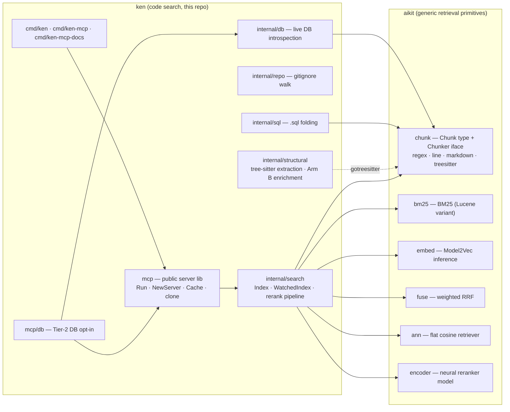
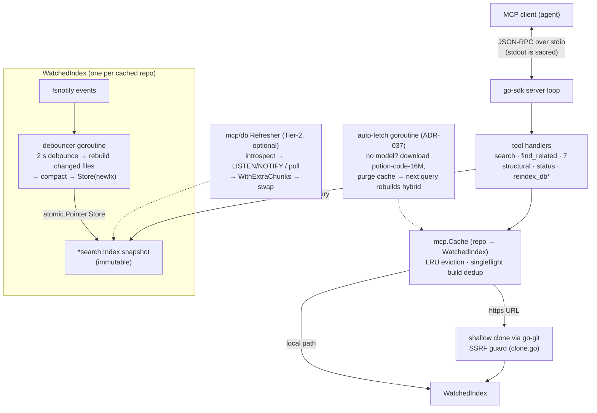

# Architecture

**Current-state map of the system.** This doc answers "what is ken *now* and where does each concern live." For *why* it's built this way, see [docs/DESIGN.md](docs/DESIGN.md) (algorithm spec, precision contracts, written stage-by-stage during the port) and [docs/internal/DECISIONS.md](docs/internal/DECISIONS.md) (ADRs). When this doc and DESIGN.md §1 disagree about layout, this doc wins — DESIGN.md predates the aikit extraction (ADR-034).

Last verified against the code: 2026-06-09 (v1.0.0).

## Bird's eye

ken is a hybrid code-search engine (BM25 lexical + Model2Vec semantic + RRF fusion + code-aware rerank, ported verbatim from [semble](https://github.com/MinishLab/semble)) packaged three ways: a CLI (`ken`), a multi-repo MCP server (`ken-mcp`), and an embeddable library (`mcp.Run`) for shipping a corpus + model + index as one static binary. Everything is pure Go, no cgo.

## Two-module map

The generic retrieval primitives live in a separate module, **[aikit](https://github.com/townsendmerino/aikit)** (extracted in ADR-034). ken composes them and owns everything code-search-specific. Dependency direction is strictly ken → aikit; aikit knows nothing about ken, MCP, or git.



What moved to aikit and what stayed: tokenizer, BM25, embedding inference, fusion, ANN, and the chunkers are **generic** → aikit. The rerank heuristics ([`rerank.go`](internal/search/rerank.go), [`penalties.go`](internal/search/penalties.go), [`adaptive.go`](internal/search/adaptive.go)) are **semble-specific** and stay in `internal/search` under the verbatim-port precision contract.

## Three deployment shapes

| Shape | Entry point | Corpus | Watching | Cache |
|---|---|---|---|---|
| CLI | [`cmd/ken`](cmd/ken/main.go) | one local path | `index --watch` (default) | none |
| Multi-repo MCP server | [`cmd/ken-mcp`](cmd/ken-mcp/main.go) → [`mcp.NewServer`](mcp/server.go) | local paths + `https://` clones per request | always | LRU + singleflight ([`mcp/cache.go`](mcp/cache.go)) |
| Embedded corpus | [`mcp.Run`](mcp/run.go) (SDK authors) | one fixed `fs.FS` (typically `//go:embed`) | never | none — optional prebuilt index (`.ken/index.bin`, ADR-024) |

`mcp.Run` deliberately carries none of the multi-repo machinery; `cmd/ken-mcp` deliberately doesn't embed. The [`mcp`](mcp/) package must stay DB-free — `mcp/db` is the opt-in bridge, enforced by [`mcp/binary_contract_test.go`](mcp/binary_contract_test.go).

## Runtime view: ken-mcp

The concurrency model is **immutable snapshots behind atomic pointers** — no RWMutex on any query path (ADR-012). An `*Index` is never mutated after construction; writers build a replacement off to the side and `atomic.Pointer.Store` it; readers do exactly one `Load()` at query entry and use that snapshot for the whole call.



\* `reindex_db` registers only when a DB is wired, so `tools/list` stays honest.

Long-lived goroutines and who owns them: the SDK stdio loop (process lifetime); one fsnotify + one debouncer goroutine per `WatchedIndex` (owned by the Cache, shut down on eviction/close — goleak-tested); the one-shot model auto-fetch ([`cmd/ken-mcp/main.go`](cmd/ken-mcp/main.go)); the DB refresher ([`mcp/db`](mcp/db/)). The same snapshot-swap pattern recurs at the `mcp.Run` layer for DB extras: `baseIx.WithExtraChunks(extras)` rebuilds against the *original* snapshot (extras replace, never accumulate — [`mcp/run.go`](mcp/run.go)).

The startup model-resolution ladder (env validation in [`cmd/ken-mcp/env.go`](cmd/ken-mcp/env.go)): explicit dir → `~/.ken/model` → auto-fetch in background, serving bm25 meanwhile. Search reads `ix.Mode()` per query, so the bm25→hybrid upgrade is invisible to clients.

## Data flow

**Index build** ([`internal/search/index.go`](internal/search/index.go)):

```
internal/repo walk (gitignore, binary/oversize skip, fs.FS canonical)
  → aikit/chunk (regex default; per-file routing by extension; markdown for docs)
  → internal/structural Arm B enrichment (ADR-035): prepend "# func: … | calls: … | raises: …"
  → aikit/bm25 BM25 postings  +  aikit/embed Model2Vec vectors (hybrid/semantic)
  → optional extras: internal/sql (.sql folding) and internal/db (live schema) chunks
```

**Query** ([`internal/search/hybrid.go`](internal/search/hybrid.go) → [`rerank.go`](internal/search/rerank.go) → [`penalties.go`](internal/search/penalties.go)):

```
query → adaptive classifier (symbol vs NL → α = 0.3 / 0.5)
  → BM25 top-N  +  flat cosine top-N      (candidateCount = topK × 5)
  → α-weighted RRF fuse (aikit/fuse)
  → boosts: file-coherence · definition · embedded-symbol · stem
  → penalties: 3 tiers (test/compat/.d.ts paths) + file-saturation decay
  → top-k  → optional neural rerank (aikit/encoder, lazy-loaded, KEN_MCP_RERANK)
```

Every constant and the pipeline order are pinned to semble's Python — see DESIGN.md §7 and the divergence notes at the top of each file.

## Invariants (the things you must not break)

1. **stdout/stderr contract** — stdout is the JSON-RPC channel; any stray write corrupts the stream. All logging goes to stderr. Enforced by `TestBinary_StdoutIsCleanJSONRPC` ([`cmd/ken-mcp/main_test.go`](cmd/ken-mcp/main_test.go)). Audit every new dependency for default stdout writers.
2. **Snapshot immutability** — an `*Index` is never mutated after construction. New state = new Index + atomic swap. If you're reaching for a mutex on a query path, you're fighting the design.
3. **Verbatim-port precision contract** — rerank/fusion constants come from semble's source and are never tuned. Changes are validated by parity (golden fixtures, the 11,447-input tokenizer harness under `-tags=parity`), not by "looks better."
4. **Float64 accumulation + `mapping[]` indirection** in embedding inference (DESIGN.md §4) — float32 accumulation silently breaks cosine parity on long inputs; zero-norm inputs yield zero vectors, never NaN.
5. **Byte fidelity** — concatenating `Chunk.Text` for a file reproduces the source bytes, across all chunkers.
6. **`mcp` stays DB-free** — no pgx/sqlite/mysql in `mcp`'s import graph ([`binary_contract_test.go`](mcp/binary_contract_test.go)); DB support enters only via `mcp/db`.
7. **Pure Go, no cgo** — the single-static-binary posture is the product. Native deps go behind interfaces with pure-Go implementations or don't go in.

## Stability tiers

**1.0-stable:** `mcp.Run` + `mcp.Options`, the MCP tool wire format (semble-compatible), `aikit/chunk`'s `Chunker` interface, the documented env vars. **Best-effort:** concrete chunkers (treesitter especially — gotreesitter-backed), `mcp.NewServer`/`Cache` internals. **No promises:** everything under `internal/`.

## Where to look

| Concern | Location |
|---|---|
| Retrieval pipeline + rerank | [`internal/search/`](internal/search/) (`hybrid.go`, `rerank.go`, `penalties.go`, `adaptive.go`) |
| Index build, serialization, extras | [`internal/search/index.go`](internal/search/index.go), [`index_serialize.go`](internal/search/index_serialize.go) |
| Watch mode | [`internal/search/watch.go`](internal/search/watch.go) (ADR-012) |
| Walker / gitignore | [`internal/repo/`](internal/repo/) |
| Structural extraction + enrichment + structural MCP tools | [`internal/structural/`](internal/structural/), [`mcp/structural_tools.go`](mcp/structural_tools.go) |
| DB indexing (static SQL / live introspection) | [`internal/sql/`](internal/sql/), [`internal/db/`](internal/db/), [`mcp/db/`](mcp/db/), [docs/db-indexing.md](docs/db-indexing.md) |
| MCP server, cache, clone, SSRF guard | [`mcp/`](mcp/) (`server.go`, `cache.go`, `clone.go`, `run.go`) |
| Binary wiring, env validation, auto-fetch | [`cmd/ken-mcp/`](cmd/ken-mcp/) (`main.go`, `env.go`) |
| Benchmarks | [`bench/ndcg/`](bench/ndcg/), [`bench/tokens/`](bench/tokens/), [docs/BENCH.md](docs/BENCH.md) |
| Chunkers, BM25, embeddings, fusion, ANN, encoder | external: [aikit](https://github.com/townsendmerino/aikit) |
